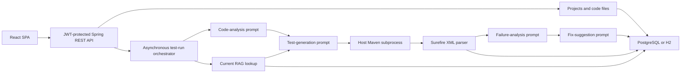
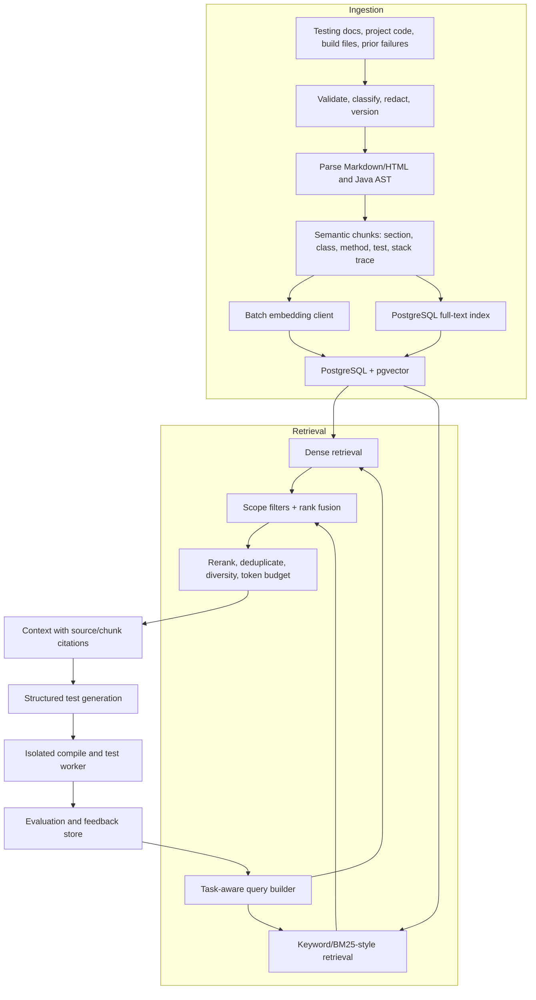

# TestPilot Project Deep Dive

## Executive assessment

TestPilot is a promising full-stack prototype for AI-assisted Java test generation. It combines a Spring Boot API, JWT/RBAC, persistence, a React dashboard, LLM adapters, retrieval, test execution, failure analysis, and a human approval state. That breadth gives it a stronger starting story than a routine CRUD portfolio project.

The implementation is not yet production-safe or sufficiently evidence-driven for the claims in the README. Its strongest current value is as a working vertical prototype. Its largest risks are the execution of user-controlled Java on the application host, path traversal during workspace creation, public self-registration as `ADMIN`, incomplete object-level authorization, a default mock pipeline that generates a trivial passing test, and a RAG implementation that loads every vector from the database and compares CSV-encoded floats in application memory.[^1][^2][^3][^4][^5]

The right next step is not to “add RAG” from zero. A RAG proof of concept already exists. The next phase should harden the platform first, then replace the proof of concept with scoped, code-aware, measurable retrieval using PostgreSQL/pgvector, hybrid search, traceable citations, and an evaluation dataset.

### Readiness summary

| Dimension | Current assessment | Why |
|---|---:|---|
| Product concept | 7/10 | Clear pain point and a coherent end-to-end workflow |
| SDE feature breadth | 6.5/10 | API, auth, database, async work, process execution, and SPA are all represented |
| SDE production evidence | 3/10 | Critical security/reliability gaps; no CI, migrations, containers, deployment, or operational proof |
| SDE portfolio readiness | 4.5/10 | Interview-worthy concept, but reviewers can quickly uncover contradictions and unsafe execution |
| Applied AI feature breadth | 5/10 | LLM abstraction, structured outputs, embeddings, retrieval, prompt augmentation, and multiple AI stages exist |
| AI/ML rigor | 1.5/10 | No dataset, baseline, retrieval/generation metrics, experiments, model tracking, or real-provider integration tests |
| Applied AI portfolio readiness | 3/10 | Good scaffold for an LLM-engineering project, not yet credible as a measured RAG system |

These scores describe the evidence in commit `3266fdb`, not the potential of the idea.

## Verified repository snapshot

The repository was inspected at commit `3266fdb696baddc5bb2ded3d98ad37e6083fae2b` (`Initial working TestPilot version`). It contains one commit, one contributor, no tags, and no additional branches.

| Area | Verified result |
|---|---|
| Backend size | 86 production Java files, approximately 3,808 lines |
| Backend tests | 15 Java test files, approximately 1,089 lines |
| Frontend | 13 source files, approximately 1,545 lines |
| Backend build | `mvn -Dmaven.repo.local=.m2 test`: **25 tests passed**, 0 failures/errors/skips |
| Strict frontend install | `npm ci`: **failed** with `ERESOLVE`; Vite 8.2.2 is outside `@vitejs/plugin-react` 4.7.0's accepted peer range |
| Compatibility-bypassed build | `npm ci --legacy-peer-deps && npm run build`: **passed**, 1,485 modules transformed |
| Built frontend assets | JS 223.53 kB (68.39 kB gzip); CSS 1.50 kB (0.55 kB gzip) |
| Dependency audit during bypassed install | 0 reported npm vulnerabilities |
| Repository operations assets | No CI workflow, Dockerfile, Compose file, database migration, API specification, deployment manifest, LICENSE, or CONTRIBUTING guide |

The backend test result is useful but should be interpreted narrowly. The suite runs with H2 and the default mock LLM. It proves controller plumbing, selected authorization paths, persistence, XML parsing, a simple Maven/JUnit run, and asynchronous state completion. It does not validate a live LLM, semantic retrieval quality, generated-test quality, hostile code isolation, PostgreSQL behavior, load, restart recovery, or the frontend.

## What the project does

TestPilot accepts Java source files, asks an LLM to analyze them, retrieves testing guidance, asks the LLM to generate JUnit tests, executes those tests with Maven, parses Surefire XML, and uses two additional LLM prompts to explain failures and suggest fixes. A React SPA lets a user register, create projects, paste files, start runs, inspect results, manage knowledge documents, and accept or reject suggestions.

### Actual execution flow

1. A public registration endpoint creates a user and returns a JWT. The request may select `DEVELOPER`, `REVIEWER`, or `ADMIN`.[^3]
2. An authenticated user creates a project and submits source code as JSON (`fileName`, `filePath`, and `content`).
3. The code-analysis component concatenates every stored file and sends the complete text to an LLM with a JSON-shaped prompt. No AST parser is used.[^6]
4. Retrieval embeds only the first source file, loads every stored chunk, computes cosine similarity in Java, and returns the top three chunks without a relevance threshold, scope filter, or reranker.[^5]
5. Test generation concatenates all files, the analysis, and retrieved content into another prompt, then stores one generated test class.[^7]
6. The executor writes the supplied paths and contents into `target/workspaces/run-{id}`, writes a fixed Maven POM, and starts `mvn clean test` as a subprocess on the application host.[^1]
7. Surefire XML is parsed into test results. Failed cases can trigger LLM-based diagnosis and a suggested replacement.
8. Accepting a suggestion changes its database status; it does not patch the code, create a commit, open a pull request, rerun tests, or prove the fix.

## What is strong today

### Software engineering strengths

- The domain is decomposed into recognizable packages for authentication, projects, testing, failures, RAG, AI clients, and shared configuration.
- The REST layer uses DTO records and Jakarta validation for several inputs.
- Passwords are BCrypt-hashed and the API is stateless with a JWT filter.
- Project read/write checks exist and tests verify that one developer cannot read another developer's project.
- A provider-facing `LlmClient` prevents prompt logic from being fully coupled to HTTP transport.
- The test-run state machine is visible and understandable (`PENDING` through completion/failure).
- The Surefire parser explicitly disables DTDs and external entities.
- The repository includes integration-style MockMvc tests and one genuine nested Maven execution test rather than only mocked unit tests.
- The README is unusually comprehensive for a first commit and provides a useful starting product narrative.

### Applied AI strengths

- Generation, embedding, and structured generation are represented as separate operations.
- Code analysis, test generation, failure explanation, and fix suggestion have separate prompts and typed responses.
- Retrieved material is already inserted into generation and failure-analysis prompts.
- A deterministic mock provider makes offline application tests repeatable.
- Human review is modeled explicitly instead of automatically applying generated fixes.

These are valuable scaffolding choices. The main need is to make the evidence match the vocabulary used to describe them.

## Claims that need correction

The README currently creates avoidable credibility risk in an interview because several claims are materially broader than the implementation.[^8]

| Current claim | Code-backed reality | Recommended wording until implemented |
|---|---|---|
| “Source Code AST Ingestion” | Source files are concatenated into a prompt; there is no parser or AST | “LLM-assisted source analysis” |
| “Sandboxed Compilation & Execution” | Maven runs directly on the application host in a separate directory | “Per-run filesystem workspace with a process timeout” |
| “Autonomous, multi-agent” | Four stateless prompt components execute in a fixed sequential workflow | “Multi-stage LLM workflow” or “agent-inspired pipeline” |
| “RAG” in the default demo | Mock embeddings are deterministic random vectors, so similarity is not semantic | “RAG scaffold; semantic retrieval requires a live embedding provider” |
| “Generated tests cover branches and edge cases” | The mock provider generates `assertTrue(true)` and does not exercise the source | “Mock generation validates orchestration only” |
| “Mockito generation” | The executor's generated POM includes JUnit but not Mockito | Add Mockito to the runtime or remove the claim |
| “Human-in-the-loop remediation” | Accept/reject only updates a status field | “Suggestion review state”; reserve “remediation” for an applied and revalidated fix |
| “Frontend compiled with 0 errors” | A clean `npm ci` fails; only peer-dependency bypass makes the build run | Fix and pin compatible dependencies, then publish CI evidence |
| “Modern dark-themed dashboard” | JSX relies heavily on Tailwind utility names, but Tailwind is not installed or compiled | Add Tailwind correctly or replace utilities with real CSS |

Accurate, narrower claims make a portfolio stronger, not weaker. They signal engineering judgment and make later improvements measurable.

## Priority gaps

### P0 — address before exposing the application or expanding RAG

#### 1. User-controlled code executes on the application host

Both uploaded source and LLM-generated tests are compiled and executed by a host Maven process. A Java static initializer, test method, annotation processor, or dependency plugin can read local files, consume CPU/memory, spawn processes, and make network calls with the application's operating-system permissions. A 60-second timeout limits duration but does not create a security boundary. Docker documents namespaces/cgroups as the mechanisms that provide process isolation and resource accounting, and notes that containers need explicit CPU/memory constraints; it also provides `--network none` for network isolation.[^9][^10][^11]

Remediation: move execution to an isolated worker. Use a non-root, read-only container with a temporary writable workspace, no host mounts or Docker socket, no outbound network during test execution, CPU/memory/PID/file-size limits, a strict wall-clock timeout, dropped capabilities, and a hardened seccomp/AppArmor profile. Resolve permitted dependencies in a separate trusted step or controlled cache.

#### 2. Supplied file paths can escape the run workspace

`workspaceDir.resolve(relativePath)` is used without rejecting absolute paths or normalizing and checking that the result still begins with the workspace root.[^1] `../` paths or an absolute path can therefore target any writable location available to the service. This is a direct match for OWASP's description of path traversal.[^12]

Remediation: accept repository-relative paths only; reject absolute paths, `..`, NULs, symlinks, and paths outside allowlisted source roots. Resolve against a canonical workspace root, normalize, and enforce `resolved.startsWith(root)`. Create files without following symlinks and enforce file/count/total-byte limits.

#### 3. Anyone can self-register as an administrator

The public registration request accepts a role, the frontend offers `ADMIN`, and the service persists the requested role.[^3][^13] This bypasses the intended admin protection on knowledge ingestion.

Remediation: public registration must always assign `DEVELOPER`. Create reviewers/admins only through a protected administrative flow, bootstrap configuration, or identity-provider group mapping. Add negative tests that submit `ADMIN` to the public endpoint.

#### 4. Fix-suggestion reads omit object authorization

`getFixSuggestion` loads a suggestion by caller-supplied analysis ID and returns it without tracing it back to a test run/project and checking access.[^4] OWASP recommends an object-level authorization check in every endpoint that uses a client-supplied object ID.[^14]

Remediation: use repository methods scoped through the authorized project or perform the same suggestion → analysis → result → run → project authorization chain used by the write endpoint. Add cross-user tests for every ID-bearing endpoint.

#### 5. Maven failures can be reported as successful test runs

The executor neither drains/captures process output nor checks `process.exitValue()` after Maven finishes.[^1] A compilation or dependency failure can yield no Surefire reports; the service then saves an empty result list and marks the run `COMPLETED`.[^15]

Remediation: concurrently capture bounded stdout/stderr, check the exit code, distinguish compile/infrastructure/test failures, require expected report output, persist a diagnostic summary, and model terminal states such as `COMPILE_FAILED`, `TESTS_FAILED`, `TIMED_OUT`, and `INFRA_FAILED`.

#### 6. Default secrets and publicly exposed operational endpoints

The repository includes a usable default JWT secret, permits all Actuator paths, and permits the H2 console matcher.[^16] The current profile separation reduces some exposure, but these defaults are unsafe for a deployed portfolio demo.

Remediation: fail startup outside tests when the JWT secret is missing/weak; expose only health/readiness publicly; restrict detailed health, metrics, and database consoles; disable the H2 console outside a local-only profile; add rate limiting and authentication-event logging.

### P1 — required for a strong SDE project

| Gap | Evidence and impact | Recommended outcome |
|---|---|---|
| Fixed executor POM | Only JUnit API/engine are available; real Spring projects, Mockito tests, Lombok, and project dependencies will not compile | Ingest a validated build descriptor or construct a controlled dependency manifest; support a documented Java project subset |
| Long transaction around external work | `@Transactional` covers LLM calls and a Maven process that may run for 60 seconds | Keep transactions short; persist transitions independently; execute external work outside DB transactions |
| In-memory async queue | `@Async` state exists only in one JVM; restart can strand runs and horizontal scaling can duplicate work | Use a durable queue/job table with leases, retries, idempotency, heartbeats, cancellation, and recovery |
| Data integrity | Entities store scalar foreign IDs; schema has no declared foreign keys, cascades, or useful indexes; project deletion only removes code files | Add Flyway/Liquibase migrations, foreign keys, indexes, controlled cascades, and transactional deletion tests |
| Spring Boot lifecycle | The project uses Spring Boot 3.2.5; Spring states that 3.2.x open-source support ended with 3.2.12 | Upgrade to an actively maintained line and add automated dependency updates[^17] |
| Frontend dependency reproducibility | Clean `npm ci` fails due incompatible peer ranges | Pin a compatible Vite/plugin pair and make strict install/build part of CI |
| Frontend styling | Tailwind-like utility names are present without Tailwind in dependencies/config; the built CSS is only 1.50 kB | Install/configure Tailwind or implement the utilities in CSS; add visual smoke tests |
| Frontend quality | No lint, typecheck, component tests, or browser tests; JavaScript rather than TypeScript | Add ESLint, formatting, TypeScript or PropTypes, Vitest/Testing Library, and Playwright smoke coverage |
| API maturity | No OpenAPI contract, pagination, versioning, idempotency, request-size policy, or standardized problem details | Publish an OpenAPI spec; generate/validate clients; paginate collections; add consistent error codes and limits |
| Observability | Actuator is enabled, but no domain metrics, traces, correlation IDs, structured logging, or alertable SLOs exist | Record queue time, phase latency, LLM tokens/cost, retrieval latency, Maven outcomes, and trace IDs |
| Error handling | Raw exception messages are returned as HTTP 500 bodies and parser failures are silently ignored | Return safe problem details, preserve internal diagnostics, and never silently convert corrupt reports into success |
| Delivery evidence | No CI, container image, deployed environment, health/readiness proof, release/tag history, or infrastructure docs | Add GitHub Actions, reproducible images, Compose for local use, a hosted demo, and release notes |
| Repository maturity | One monolithic commit; no LICENSE, issue templates, ADRs, or contribution guide | Add a license, ADRs, roadmap/issues, smaller commits, and a security/threat-model document |

### P1 — required for a strong AI/ML or applied-AI project

#### Current RAG is a scaffold, not a production retrieval system

The ingestion path uses overlapping 500-character windows without token counting, language/section awareness, metadata, or deduplication. Vectors are serialized as comma-separated text. Every query loads all chunks and computes cosine similarity in the JVM. There is no scope filter, similarity floor, keyword retrieval, reranking, citation propagation, index, or latency/recall measurement.[^5][^18]

The default provider makes this even more important: it seeds a pseudorandom 1,536-dimensional vector from `text.hashCode()`.[^2] The output is stable for tests but has no semantic geometry. The current end-to-end demo can therefore return arbitrary “relevant” chunks and still generate a trivial passing test.

PostgreSQL's pgvector extension supports native exact and approximate nearest-neighbor search, HNSW and IVFFlat indexes, cosine distance, metadata filtering patterns, and hybrid search with PostgreSQL full-text search.[^19] That is a natural fit because this project already targets PostgreSQL.

#### Missing AI engineering evidence

| Missing evidence | Why it matters for AI/ML hiring |
|---|---|
| Curated evaluation dataset | There is no repeatable definition of good retrieval, test generation, or failure diagnosis |
| Baseline and ablation | No comparison of no-RAG vs vector-only vs hybrid/reranked RAG |
| Retrieval metrics | No Recall@k, Precision@k, MRR, nDCG, or latency distribution |
| Generation metrics | No compile rate, test pass validity, line/branch coverage delta, mutation score, flaky-test rate, or defect-detection rate |
| Grounding metrics | No citation correctness, context precision, answer faithfulness, or unsupported-claim rate |
| Model/prompt tracking | Runs do not persist provider, model, embedding model/dimension, prompt version, parameters, tokens, cost, or latency |
| Live-provider tests | The HTTP client has no contract test, retry/backoff, total request timeout, circuit breaker, or robust schema enforcement |
| Prompt-injection defenses | Source code and knowledge text are interpolated directly into instructions without trust boundaries or output policy |
| Data governance | No document provenance, content hash/version, parser version, access scope, deletion audit, or PII/secret handling |
| Experiment narrative | There is no notebook/report explaining hypotheses, corpus design, error taxonomy, experiments, and results |

NIST's Generative AI Profile explicitly frames trustworthy GenAI work across design, development, use, and evaluation.[^20] Even a compact evaluation harness and a documented error analysis would improve this project's AI credibility more than adding another agent name.

## Role-specific portfolio gap analysis

### Targeting SDE roles

This can become a strong backend/full-stack project because it naturally raises nontrivial engineering topics: untrusted execution, job orchestration, access control, persistence, API design, process supervision, observability, and concurrency. The portfolio should lead with those engineering decisions.

What a reviewer can currently credit:

- A complete vertical slice rather than isolated algorithms.
- Spring Boot layering, security, DTO validation, database persistence, and integration tests.
- A visible stateful workflow with asynchronous execution.
- Parsing external process output and exposing it in a UI.

What prevents a strong SDE signal today:

- The central feature is unsafe by design on a shared/deployed host.
- Clean frontend setup is broken.
- Reliability semantics are incorrect when compilation fails.
- Persistence lacks migrations and referential integrity.
- There is no CI/CD, deployment, operational dashboard, load evidence, or recovery design.
- The repository history does not show iterative engineering or tradeoff decisions.
- Documentation overclaims isolation and AST analysis, which invites adverse code-review questions.

For entry-level SDE roles, fixing P0, adding CI/Compose/Flyway/OpenAPI, and deploying a constrained demo would make the project interview-ready. For experienced backend roles, also add a durable worker queue, idempotency/recovery, concurrency/load testing, traces/SLOs, and a threat model.

### Targeting AI/ML roles

The current project is better aligned with **Applied AI / LLM Engineer** roles than ML research, data science, or model-training roles. It integrates models but does not train or analyze a statistical model. That is acceptable if described accurately.

What a reviewer can currently credit:

- A provider abstraction and typed model outputs.
- Retrieval and prompt augmentation wired into a real product flow.
- Multiple task-specific prompt stages.
- Offline deterministic mocks and human review state.

What prevents a strong AI/ML signal today:

- Retrieval under the default configuration is random, not semantic.
- The term “agent” describes a fixed prompt call rather than planning, tools, memory, reflection, or autonomous control.
- No evaluation set or metric demonstrates that RAG improves generated tests.
- No corpus strategy, chunking experiment, retrieval error analysis, or model comparison exists.
- Generated tests are not scored for compile success, behavioral relevance, coverage, mutation testing, or false positives.
- Model calls and retrieved evidence are not traceable or reproducible.

For Applied AI roles, the highest-value differentiator is a measured RAG experiment: build a curated Java-testing benchmark, compare retrieval strategies, and demonstrate a statistically clear improvement in compile rate, mutation score, or defect detection. For broader AIML roles, add a separate modeling component only if the target jobs expect classical ML—for example, train and calibrate a failure-severity or flaky-test classifier from a documented dataset. Do not add a model merely to use the label “ML.”

## Production-grade RAG target

### Design goal

Given a Java symbol, project context, framework/version, and testing task, retrieve the smallest set of authoritative and project-specific evidence that helps an LLM generate compilable, behaviorally relevant tests, while recording enough provenance to reproduce and evaluate the result.

### Recommended architecture

### Corpus design

Use two separately scoped corpora:

1. **Authoritative testing knowledge**: versioned JUnit, Mockito, Spring Test, language, secure-coding, and organization-specific testing guidance. Preserve title, URL, framework, version, section path, license/access note, ingestion time, and content hash.
2. **Project context**: source symbols, imports, method bodies, callers/callees, existing tests, build files, dependency versions, configuration, prior failures, and accepted/rejected suggestions. Scope every row by project/tenant and commit SHA.

Avoid embedding an entire source repository as anonymous text. For Java, parse code into symbol-aware chunks using JavaParser, Eclipse JDT, or Tree-sitter. Retain package, class, method signature, line range, imports, annotations, and relationship metadata. Keep raw content available for citations and recompilation.

### Storage model

Introduce versioned migrations and a schema similar to:

| Table | Important fields |
|---|---|
| `knowledge_documents` | `id`, `scope_type`, `scope_id`, `title`, `source_uri`, `framework`, `framework_version`, `content_hash`, `document_version`, `status`, `parser_version`, timestamps |
| `knowledge_chunks` | `id`, `document_id` FK, `chunk_index`, `content`, `section_path`, `symbol`, `language`, `token_count`, `metadata jsonb`, `content_hash`, `embedding vector(n)`, `embedding_model`, `search_vector tsvector` |
| `retrieval_traces` | query, filters, candidate IDs/scores, fused/reranked results, latency, retrieval version |
| `generation_traces` | run ID, model, prompt version, cited chunk IDs, tokens, cost, latency, structured output status |
| `evaluation_cases/results` | dataset version, input, expected evidence/behavior, configuration, metrics, failure category |

Use a foreign key with cascade from chunks to documents, unique constraints for idempotent ingestion, B-tree indexes for scope/version filters, GIN for full text, and HNSW for vector retrieval when corpus size justifies approximate search. pgvector notes that HNSW offers a better speed/recall tradeoff than IVFFlat but uses more memory and builds more slowly; begin with exact retrieval for a small corpus, establish recall metrics, then introduce HNSW.[^19]

### Retrieval pipeline

1. Build a query from the target symbol, analysis result, build dependencies, failure text, and task type. Do not use only the first file.
2. Apply hard filters for tenant/project, language, framework/version, document status, and access policy.
3. Retrieve dense and lexical candidates independently.
4. Fuse ranks using Reciprocal Rank Fusion; deduplicate by content/symbol hash.
5. Rerank the top candidate set using a cross-encoder or a carefully evaluated model.
6. Apply a relevance threshold and diversity rule; returning no context is valid.
7. Pack context by token budget, with stable source/chunk IDs and explicit untrusted-data delimiters.
8. Require structured generation to cite the evidence used; surface citations in the UI.

### Evaluation plan

Create an initial gold dataset of 50–100 Java tasks spanning pure unit logic, exceptions, parameterized tests, mocking, Spring services/controllers, repositories, concurrency, and representative failures. Each case should include source, build metadata, expected relevant documents/symbols, seeded defects, and validation tests.

Measure:

- **Retrieval:** Recall@3/5/10, MRR, nDCG@k, context precision, p50/p95 latency.
- **Generation:** JSON/schema success, compile rate, test execution rate, assertion relevance, line/branch coverage delta, mutation score, seeded-defect detection, flaky-test rate.
- **Grounding:** citation precision/recall, unsupported guidance rate, correct framework-version rate.
- **Operations:** model and embedding latency, tokens, cost per successful generated suite, queue time, worker failure rate.

Run at least four configurations: no RAG, current dense-only retrieval, hybrid retrieval, and hybrid plus reranking. Pin dataset, prompt, model, and corpus versions. OpenAI's Eval API is one possible external harness and explicitly models datasets plus testing criteria; a repository-local provider-neutral harness is preferable for this project's portability.[^21]

### Security and safety controls for RAG

- Treat source code, comments, READMEs, stack traces, and knowledge documents as untrusted data, not instructions.
- Enforce corpus authorization before retrieval, not after generation.
- Redact secrets before storage or external embedding calls.
- Limit document sizes, chunk counts, query `topK`, and ingestion concurrency.
- Validate content type and source provenance; quarantine ingestion failures.
- Defend against embedding dimension/model drift by storing model and dimension and reindexing explicitly.
- Do not allow generated citations or code paths to control filesystem writes.
- Keep the test-execution security boundary independent of model quality.

## Implementation roadmap

### Milestone 0 — make the current baseline honest and reproducible

**Outcome:** a clean clone can be built in CI, and documentation accurately describes the prototype.

- Align the Vite and React plugin versions so strict `npm ci` succeeds.
- Install/configure Tailwind or replace Tailwind utility strings.
- Add Maven Wrapper and pin Node via `.nvmrc`/`.tool-versions` plus `engines`.
- Add GitHub Actions for backend tests, strict frontend install/build, lint, and dependency scanning.
- Correct README claims and broken machine-specific `file://` links.
- Add LICENSE, architecture decision records, roadmap, and threat-model stub.

### Milestone 1 — close P0 security and correctness gaps

**Outcome:** unauthorized users cannot escalate/read cross-project data, and a compile failure cannot appear as success.

- Force public registration to `DEVELOPER`; protect role administration.
- Centralize object authorization and add a cross-tenant endpoint test matrix.
- Canonicalize/allowlist source paths and enforce upload limits.
- Capture Maven output and exit status; expand terminal status/error modeling.
- Require secrets by environment; lock down Actuator and H2 console.
- Add prompt/data trust delimiters and safe error responses.

### Milestone 2 — build a real execution boundary

**Outcome:** malicious or broken generated code cannot access the application host or exhaust it.

- Implement a dedicated isolated worker with non-root containers, no network during execution, read-only root, temporary volumes, and hard resource limits.
- Add cancellation, cleanup, bounded logs, dependency policy, and malicious-fixture tests.
- Move from in-memory `@Async` work to durable jobs with leases/retries/idempotency and restart recovery.
- Keep external work outside database transactions.

### Milestone 3 — establish data and API foundations

**Outcome:** PostgreSQL is reproducible, constrained, observable, and deployable.

- Add Flyway migrations, foreign keys, indexes, pagination, and tested cascades.
- Upgrade Spring Boot to a maintained version.
- Add OpenAPI, consistent problem details, correlation IDs, tracing, and domain metrics.
- Add Docker/Compose for app, PostgreSQL/pgvector, frontend, and worker.
- Deploy a staging demo and publish a short operations/runbook page.

### Milestone 4 — replace the RAG proof of concept

**Outcome:** retrieval is semantic, scoped, traceable, and efficient.

- Split generation and embedding provider interfaces.
- Implement versioned, idempotent asynchronous ingestion.
- Add document-aware and Java symbol-aware chunkers.
- Store embeddings in pgvector; add full-text search, filters, RRF, thresholds, and citations.
- Index both authoritative testing guidance and project-specific code/build/test context.
- Add retrieval traces and an admin ingestion-status UI.

### Milestone 5 — prove AI value

**Outcome:** the portfolio contains reproducible evidence that RAG improves testing outcomes.

- Check in a versioned evaluation dataset and evaluation CLI/service.
- Compare no-RAG, dense, hybrid, and reranked variants.
- Publish metrics, error analysis, and cost/latency tradeoffs.
- Add prompt/model/version metadata and regression gates.
- Integrate coverage and mutation testing; use compile rate and mutation score as headline metrics.

### Milestone 6 — complete the developer workflow

**Outcome:** acceptance means a verified software change rather than a status toggle.

- Integrate a Git provider using an app/token with least privilege.
- Produce a real diff against a commit SHA.
- On acceptance, create a branch/commit or pull request, run isolated validation, and attach evidence.
- Record reviewer, decision reason, timestamps, validation result, and rollback path.

## Suggested pull-request sequence

1. `build: restore clean frontend install and CI`
2. `security: fix registration roles and object authorization`
3. `security: validate workspace paths and execution inputs`
4. `testing: model Maven compile/infrastructure failures correctly`
5. `platform: add Flyway schema, FKs, and PostgreSQL integration tests`
6. `executor: move test runs to an isolated worker`
7. `jobs: durable orchestration with retries and recovery`
8. `rag: pgvector schema and idempotent ingestion`
9. `rag: Java-aware chunking, hybrid retrieval, and citations`
10. `evals: dataset, baselines, retrieval metrics, and mutation score`
11. `product: cited evidence and validated fix workflow in the UI`
12. `ops: tracing, SLO dashboard, staging deployment, and runbook`

Each PR should include tests, an ADR when a security/architecture choice changes, and before/after evidence.

## Definition of “portfolio-ready”

### SDE-ready exit criteria

- Clean clone passes backend tests, strict frontend install/build, lint, and browser smoke tests in CI.
- No public role escalation, known object-level authorization gap, default production secret, or path traversal.
- Untrusted compilation/execution happens in a verified restricted worker.
- Nonzero build exits, timeouts, malformed reports, and worker crashes have correct persisted states.
- PostgreSQL schema is migration-managed with foreign keys and indexes.
- Jobs survive application restart and do not execute twice under normal retry conditions.
- A deployed demo exposes health/readiness and useful traces/metrics without exposing sensitive details.
- README claims, threat model, architecture, and benchmark results are reproducible.

### Applied-AI-ready exit criteria

- Live embedding/generation adapters have contract tests and recorded provider/model versions.
- Retrieval is tenant/project scoped, uses pgvector plus lexical search, and returns citations.
- A checked-in gold dataset covers at least 50 representative tasks.
- CI or a scheduled evaluation reports retrieval and generation regressions.
- Results show whether RAG beats no-RAG on compile rate, coverage/mutation score, and defect detection.
- Prompt injection, secret redaction, data provenance, model drift, and cost/latency are explicitly handled.
- The UI shows why a chunk was retrieved and what evidence influenced a generated test.

## Recommended portfolio narrative

The strongest honest positioning is:

> TestPilot is a secure, evaluation-driven platform for generating and validating Java tests. It combines code-aware hybrid retrieval, structured LLM generation, isolated build workers, durable orchestration, and measurable quality gates such as compile rate, coverage, and mutation score.

Until those milestones are complete, use:

> TestPilot is a full-stack prototype that explores a multi-stage LLM workflow for Java test generation, retrieval-assisted prompts, isolated-workspace Maven execution, failure explanation, and human review. Current work focuses on hardening execution and replacing the in-memory retrieval proof of concept with measured pgvector-based RAG.

The second description is accurate today and sets up a compelling engineering progression.

## Sources

[^1]: TestPilot, [`TestExecutionService.java`, lines 29–130](https://github.com/Sarthak2501/testpilot/blob/3266fdb696baddc5bb2ded3d98ad37e6083fae2b/src/main/java/com/testpilot/testing/execution/TestExecutionService.java#L29-L130), commit `3266fdb`.
[^2]: TestPilot, [`MockLlmClient.java`, lines 49–90](https://github.com/Sarthak2501/testpilot/blob/3266fdb696baddc5bb2ded3d98ad37e6083fae2b/src/main/java/com/testpilot/ai/client/MockLlmClient.java#L49-L90), commit `3266fdb`.
[^3]: TestPilot, [`AuthService.java`, lines 30–56](https://github.com/Sarthak2501/testpilot/blob/3266fdb696baddc5bb2ded3d98ad37e6083fae2b/src/main/java/com/testpilot/auth/service/AuthService.java#L30-L56) and [`RegisterRequest.java`](https://github.com/Sarthak2501/testpilot/blob/3266fdb696baddc5bb2ded3d98ad37e6083fae2b/src/main/java/com/testpilot/auth/dto/RegisterRequest.java), commit `3266fdb`.
[^4]: TestPilot, [`FailureService.java`, lines 135–155](https://github.com/Sarthak2501/testpilot/blob/3266fdb696baddc5bb2ded3d98ad37e6083fae2b/src/main/java/com/testpilot/failure/service/FailureService.java#L135-L155), commit `3266fdb`.
[^5]: TestPilot, [`RagService.java`, lines 40–89](https://github.com/Sarthak2501/testpilot/blob/3266fdb696baddc5bb2ded3d98ad37e6083fae2b/src/main/java/com/testpilot/rag/service/RagService.java#L40-L89), commit `3266fdb`.
[^6]: TestPilot, [`CodeAnalysisAgent.java`, lines 20–39](https://github.com/Sarthak2501/testpilot/blob/3266fdb696baddc5bb2ded3d98ad37e6083fae2b/src/main/java/com/testpilot/ai/agent/CodeAnalysisAgent.java#L20-L39), commit `3266fdb`.
[^7]: TestPilot, [`TestGenerationAgent.java`, lines 21–51](https://github.com/Sarthak2501/testpilot/blob/3266fdb696baddc5bb2ded3d98ad37e6083fae2b/src/main/java/com/testpilot/ai/agent/TestGenerationAgent.java#L21-L51) and [`TestRunOrchestrator.java`, lines 77–164](https://github.com/Sarthak2501/testpilot/blob/3266fdb696baddc5bb2ded3d98ad37e6083fae2b/src/main/java/com/testpilot/testing/orchestrator/TestRunOrchestrator.java#L77-L164), commit `3266fdb`.
[^8]: TestPilot, [`README.md`, lines 24–83](https://github.com/Sarthak2501/testpilot/blob/3266fdb696baddc5bb2ded3d98ad37e6083fae2b/README.md#L24-L83), commit `3266fdb`.
[^9]: Docker, [Docker Engine security](https://docs.docker.com/engine/security/), accessed September 11, 2026.
[^10]: Docker, [Resource constraints](https://docs.docker.com/engine/containers/resource_constraints/), accessed September 11, 2026.
[^11]: Docker, [None network driver](https://docs.docker.com/engine/network/drivers/none/), accessed September 11, 2026.
[^12]: OWASP Foundation, [Path Traversal](https://owasp.org/www-community/attacks/Path_Traversal), accessed September 11, 2026.
[^13]: TestPilot, [`Register.jsx`, lines 87–96](https://github.com/Sarthak2501/testpilot/blob/3266fdb696baddc5bb2ded3d98ad37e6083fae2b/frontend/src/pages/Register.jsx#L87-L96), commit `3266fdb`.
[^14]: OWASP API Security Project, [API1:2023 Broken Object Level Authorization](https://owasp.org/API-Security/editions/2023/en/0xa1-broken-object-level-authorization/), 2023.
[^15]: TestPilot, [`TestRunService.java`, lines 68–98](https://github.com/Sarthak2501/testpilot/blob/3266fdb696baddc5bb2ded3d98ad37e6083fae2b/src/main/java/com/testpilot/testing/service/TestRunService.java#L68-L98), commit `3266fdb`.
[^16]: TestPilot, [`application.yml`](https://github.com/Sarthak2501/testpilot/blob/3266fdb696baddc5bb2ded3d98ad37e6083fae2b/src/main/resources/application.yml) and [`SecurityConfig.java`, lines 28–41](https://github.com/Sarthak2501/testpilot/blob/3266fdb696baddc5bb2ded3d98ad37e6083fae2b/src/main/java/com/testpilot/common/config/SecurityConfig.java#L28-L41), commit `3266fdb`.
[^17]: Moritz Halbritter, Spring, [Spring Boot 3.2.12 available now](https://spring.io/blog/2024/11/21/spring-boot-3-2-12-available-now/), November 21, 2024.
[^18]: TestPilot, [`ChunkingService.java`](https://github.com/Sarthak2501/testpilot/blob/3266fdb696baddc5bb2ded3d98ad37e6083fae2b/src/main/java/com/testpilot/rag/service/ChunkingService.java), [`DocumentChunk.java`](https://github.com/Sarthak2501/testpilot/blob/3266fdb696baddc5bb2ded3d98ad37e6083fae2b/src/main/java/com/testpilot/rag/entity/DocumentChunk.java), and [`VectorSearchService.java`](https://github.com/Sarthak2501/testpilot/blob/3266fdb696baddc5bb2ded3d98ad37e6083fae2b/src/main/java/com/testpilot/rag/service/VectorSearchService.java), commit `3266fdb`.
[^19]: pgvector maintainers, [pgvector: Open-source vector similarity search for Postgres](https://github.com/pgvector/pgvector), accessed September 11, 2026.
[^20]: Chloe Autio et al., NIST, [Artificial Intelligence Risk Management Framework: Generative Artificial Intelligence Profile (NIST AI 600-1)](https://doi.org/10.6028/NIST.AI.600-1), July 2024.
[^21]: OpenAI, [Create Eval API Reference](https://developers.openai.com/api/reference/java/resources/evals/methods/create), accessed September 11, 2026.
