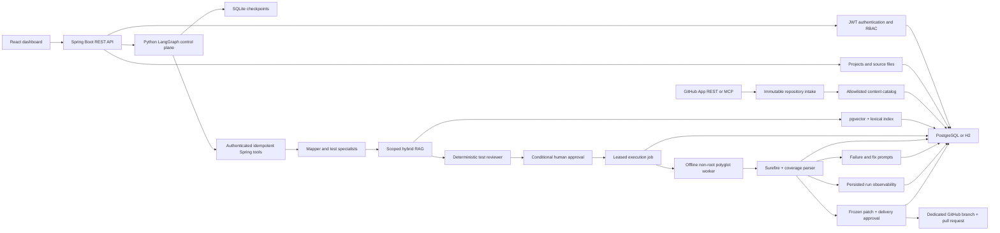

# TestPilot

TestPilot is a full-stack prototype for repository-driven, AI-assisted Java test generation and execution. The current application can connect an allowlisted GitHub repository through MCP or a least-privilege GitHub App, resolve an immutable commit, build a safe text catalog, run a checkpointed LangGraph workflow with specialized test agents and human approval, retrieve project-scoped hybrid RAG context, execute Java through durable isolated jobs and multilingual drafts through explicit offline container attempts, persist evaluation and observability evidence, and turn a successful run into a separately approved GitHub branch and pull request.

The product is a repository-driven, agentic testing platform: a user supplies a GitHub repository, specialized LangGraph workflows plan unit, module/component, and integration tests, isolated workers run them against an immutable revision, a measured RAG pipeline supplies project and framework context, and an approved delivery workflow publishes evidence-backed test changes for normal GitHub review.

System and end-to-end testing are explicitly outside the project scope. TestPilot will stop at integration testing and will not provision or validate a complete deployed application environment.

> All application test execution requires the prebuilt offline polyglot Docker
> worker, including H2. There is no host fallback or runtime dependency download.
> See [revised Phase 3](docs/REVISED_PHASE_3.md) for setup, support limits and
> verification evidence. All 25 container acceptance cases passed locally.

Phase 4 adds [saved test reports and source/test guidance](docs/REVISED_PHASE_4.md), selected-source line coverage for all four supported languages, and authenticated JSON downloads. Rebuild the worker image to enable coverage; pre-Phase-4 attempts require an explicit rerun. Suggestions are evidence-based review guidance, not verified fixes.

Phase 5 adds an **AI Code Reviewer** panel to project details. Load scope, start an explicit review, inspect good practices/improvements with exact source evidence, and download the saved JSON. A real provider is required; mock mode reports unavailable. See [Phase 5 setup and limits](docs/REVISED_PHASE_5.md).

## Project status

The revised multi-language product starts with [Phase 1: URL intake and file selection](docs/REVISED_PHASE_1.md).
It adds a single GitHub URL form, a multi-language catalog, excluded-file evidence,
and read-only manifest hints. [Revised Phase 2](docs/REVISED_PHASE_2.md) adds
Java/Python/JS/TS planning, framework-specific generation, static validation and saved
drafts. [Revised Phase 3](docs/REVISED_PHASE_3.md) completes the partial container-only
execution path for Java/Python/JS/TS, adds validation and actual-worker CI checks.
The [Phase 4 structured report](docs/REVISED_PHASE_4.md) adds failure classification, suggestions and selected-source coverage. The [Phase 5 AI Code Reviewer](docs/REVISED_PHASE_5.md) adds saved multi-file reviews, positive practices, security/performance findings and validated source citations. [Phase 6](docs/REVISED_PHASE_6.md) adds snapshot-scoped related-symbol context, versioned language standards, checked cross-file citations, and reproducible reviewer/test-usefulness evaluation. Recorded scores distinguish authored fixtures from live-model quality.
Mock-provider drafts are skipped scaffolds, not behavioral tests. The current
[analysis and phase gates](docs/REVISED_PROJECT_ANALYSIS.md) distinguish this revised
plan from the historical milestones below.

| Capability | Current implementation | Target implementation |
|---|---|---|
| Repository input | GitHub App REST and GitHub MCP connectors, immutable SHA ingestion, plus legacy pasted files | Installation UI polish and provider contract testing against a live GitHub sandbox |
| Orchestration | Separate Python LangGraph control plane, SQLite checkpoints, conditional routes, retry budgets, human interrupt/resume, and durable execution jobs | Shared production graph checkpointer and external queue workers at horizontal scale |
| Test types | Conditional unit, module/component, and integration specialists with level policies, coverage, and optional mutation analysis | Broader framework/build templates and measured benchmark quality |
| Code analysis | Deterministic repository metadata plus bounded LLM analysis | Build-aware and Java symbol/AST analysis |
| Retrieval | Versioned symbol/section chunks, project-scoped pgvector plus lexical search, fusion, reranking, token packing, exact traces, and citations | Benchmark-driven tuning and provider contract tests |
| AI provider | Separate deterministic/OpenAI-compatible generation and embedding interfaces | Additional provider adapters and measured model comparisons |
| Execution | Leased Java jobs and persisted draft attempts share an offline polyglot worker, bounded tmpfs/resources, read-only root, no capabilities/network, cleanup and bounded evidence | External autoscaled workers and stronger platform sandboxing |
| Evaluation | Pinned offline unit/module/integration benchmark with retrieval, compilation, coverage, seeded mutation, flakiness, latency, token, and cost evidence | Larger datasets and separately published live-provider comparisons |
| Delivery | Frozen SHA-256 patch, separate approval, repository-scoped GitHub App write token, dedicated branch, evidence-rich PR, audit trail, and rollback path | Live GitHub sandbox/provider conformance testing and deployment migration tooling |

The detailed baseline assessment is in [PROJECT_DEEP_DIVE.md](PROJECT_DEEP_DIVE.md), and the approved implementation sequence is in [ROADMAP.md](ROADMAP.md).

## Current architecture



LangGraph owns typed workflow state, conditional routing, retry policy, checkpoints, and human interrupts. Spring owns authentication, authorization, repository state, model calls, execution, and audit records. Agents cannot choose arbitrary tools or execute shell commands: every node maps to a compiled, authenticated Spring tool with an idempotency key and input hash.

## Technology

- Java 17 and Spring Boot 3.2.5
- Spring Security, JWT, JPA, PostgreSQL/pgvector, and H2
- Maven 3.9.11 through Maven Wrapper
- React 18, React Router, Vite 7, and Tailwind CSS 3
- JUnit 5, Spring Security Test, MockMvc, and Surefire
- Python 3.12+, LangGraph 1.2, FastAPI, HTTPX, and a SQLite checkpointer
- Docker Engine for the isolated polyglot worker in every profile

## Prerequisites

- JDK 17
- Node.js 22 (the repository includes `.nvmrc`)
- npm 10 or newer
- Python 3.12 or newer
- Docker Engine for test execution in every profile; PostgreSQL with pgvector for `dev` (H2 needs no external database)

Maven does not need to be installed globally because the repository includes `mvnw` and `mvnw.cmd`.

## Run locally

### Backend with H2

```bash
./mvnw spring-boot:run -Dspring-boot.run.profiles=h2
```

The API starts at `http://localhost:8080`. The H2 console is intended only for this local profile.

### LangGraph orchestrator

Run the Spring API first. In a second terminal, use the same internal token on both sides:

```bash
cd orchestrator
python3 -m venv .venv
.venv/bin/python -m pip install -r requirements.lock
export WORKFLOW_INTERNAL_TOKEN=test-only-workflow-token-at-least-32-bytes
export TESTPILOT_API_BASE=http://localhost:8080
export LANGGRAPH_CHECKPOINT_PATH=./data/checkpoints.sqlite3
.venv/bin/uvicorn app.main:app --host 127.0.0.1 --port 8090
```

For a non-H2 Spring profile, also export the same `WORKFLOW_INTERNAL_TOKEN` before starting Spring. The local checkpoint database is intentionally ignored by Git.

### Frontend

```bash
cd frontend
nvm use
npm ci
npm run dev
```

The UI starts at `http://localhost:3000` and proxies `/api` requests to the backend.

### PostgreSQL development profile

Start pgvector and build the execution worker, then supply configuration through the environment:

```bash
docker compose up -d postgres
docker build -t testpilot-polyglot:local -f worker/polyglot/Dockerfile .
export SPRING_PROFILES_ACTIVE=dev
export DB_URL=jdbc:postgresql://localhost:5432/testpilot_db
export DB_USERNAME=testpilot
export DB_PASSWORD=testpilot
export JWT_SECRET=replace-with-a-long-random-secret
export WORKFLOW_INTERNAL_TOKEN=replace-with-another-long-random-secret
export TEST_SECURE_WORKER_IMAGE=testpilot-polyglot:local
./mvnw spring-boot:run
```

The current `dev` profile enables pgvector and creates HNSW/full-text indexes after Hibernate initializes the schema. Versioned database migrations remain required before a public deployment.

## Verify the project

Run the same quality gates used by CI:

```bash
./mvnw --batch-mode test
python -m unittest discover -s evaluation/tests -v
python evaluation/run_evaluation.py --check
cd orchestrator
python -m pip install -r requirements.lock
python -m compileall -q app tests
python -m pytest
cd frontend
npm ci
npm run lint
npm run build
npm audit --audit-level=high
cd ..
docker build -t testpilot-polyglot:local -f worker/polyglot/Dockerfile .
python3 -m unittest discover -s worker/polyglot -p 'test_*.py' -v
python3 worker/polyglot/smoke.py --image testpilot-polyglot:local
```

CI configuration lives in [.github/workflows/ci.yml](.github/workflows/ci.yml).

## Configuration

| Environment variable | Default | Purpose |
|---|---|---|
| `SPRING_PROFILES_ACTIVE` | `dev` | Selects PostgreSQL development or `h2` local profile |
| `PORT` | `8080` | Backend HTTP port |
| `DB_URL` | Local PostgreSQL URL | JDBC connection URL |
| `DB_USERNAME` | `testpilot` | Database username |
| `DB_PASSWORD` | `testpilot` | Database password |
| `JWT_SECRET` | None outside H2 | JWT signing secret; at least 32 UTF-8 bytes |
| `JWT_EXPIRATION_MS` | `86400000` | Token lifetime in milliseconds |
| `BOOTSTRAP_ADMIN_ENABLED` | `false` | Explicitly enables one administrator bootstrap at startup |
| `BOOTSTRAP_ADMIN_NAME` | `TestPilot Administrator` | Bootstrap administrator display name |
| `BOOTSTRAP_ADMIN_EMAIL` | Empty | Bootstrap administrator email |
| `BOOTSTRAP_ADMIN_PASSWORD` | Empty | Bootstrap administrator password; at least 12 characters |
| `AI_PROVIDER` | `mock` | Use `mock` or `openai` |
| `AI_MODEL` | Provider client default | Generation model identifier stored with invocation evidence |
| `AI_API_KEY` | Empty | Credential for the OpenAI-compatible provider |
| `AI_EMBEDDING_PROVIDER` | `mock` | Embedding provider, independently selected from generation |
| `AI_EMBEDDING_MODEL` | `text-embedding-3-small` | Versioned embedding model metadata and OpenAI model |
| `AI_EMBEDDING_DIMENSIONS` | `1536` | Must match the pgvector column and provider output |
| `LANGGRAPH_ORCHESTRATOR_URL` | `http://localhost:8090` | Internal LangGraph service URL used by Spring |
| `WORKFLOW_INTERNAL_TOKEN` | None outside H2 | Shared Spring/LangGraph credential; at least 32 UTF-8 bytes |
| `TESTPILOT_API_BASE` | `http://localhost:8080` | Spring workflow-tool base URL used by LangGraph |
| `LANGGRAPH_CHECKPOINT_PATH` | `orchestrator/data/checkpoints.sqlite3` | Local durable checkpoint database |
| `TEST_SECURE_WORKER_IMAGE` | `testpilot-polyglot:local` | Reviewed prebuilt offline image; runtime pulls are disabled |
| `TEST_EXECUTION_MAX_ATTEMPTS` | `3` | Legacy Java durable infrastructure retry budget |
| Worker resource limits | Fixed policy | 768 MiB RAM, 1 CPU, 128 PIDs, bounded tmpfs, 55-second worker / 70-second host deadline; see Phase 3 |
| `RAG_VECTOR_STORE` | `pgvector` (`memory` in H2) | Dense storage/query backend |
| `RAG_INGESTION_VERSION` | `rag-v2` | Idempotent index format/version identity |
| `RAG_RELEVANCE_THRESHOLD` | `0.08` | Minimum deterministic reranker score |
| `RAG_TOKEN_BUDGET` | `6000` | Maximum retrieved context budget |
| `AI_INPUT_COST_PER_MILLION_TOKENS` | `0` | Configured estimate used for generation input cost evidence |
| `AI_OUTPUT_COST_PER_MILLION_TOKENS` | `0` | Configured estimate used for generation output cost evidence |
| `AI_EMBEDDING_COST_PER_MILLION_TOKENS` | `0` | Configured estimate used for query-embedding cost evidence |

There is no production JWT fallback: `JWT_SECRET` must contain at least 32 UTF-8 bytes. The H2 profile supplies a test-only key.

### GitHub repository access

For the production path, register a GitHub App with repository **Contents: read and write** and **Pull requests: read and write**, then configure its setup callback and webhook URL. TestPilot does not hold a broad reusable write token: ingestion requests a short-lived contents-read token, while an approved delivery requests a separate short-lived token narrowed to one repository with contents-write and pull-request-write permissions.

| Environment variable | Purpose |
|---|---|
| `GITHUB_APP_ID` | GitHub App identifier |
| `GITHUB_APP_SLUG` | App slug used to start the installation flow |
| `GITHUB_APP_PRIVATE_KEY` | PKCS#8 PEM private key; escaped newlines are accepted |
| `GITHUB_WEBHOOK_SECRET` | HMAC secret for signed GitHub webhook deliveries |
| `GITHUB_API_BASE` | REST API base; defaults to `https://api.github.com` |
| `GITHUB_MCP_TOKEN` | Token for the configured GitHub MCP endpoint |
| `GITHUB_MCP_ENDPOINT` | Streamable HTTP MCP endpoint |
| `GITHUB_MCP_ALLOWED_REPOSITORIES` | Comma-separated `owner/repository` allowlist enforced before MCP calls |

The MCP adapter invokes only repository read tools and can never deliver a patch. The GitHub App adapter is the multi-user write boundary because installation grants are bound to a TestPilot user through a one-time state. TestPilot creates only `testpilot/...` branches from the analyzed commit; it never updates the default/protected branch directly.

The mock provider is deterministic and useful for offline workflow tests. Its embeddings are not semantic, and its generated test is intentionally trivial; it does not demonstrate real test-generation quality.

## API areas

| Area | Base route | Purpose |
|---|---|---|
| Authentication | `/api/auth` | Register and log in |
| Managed users | `/api/admin/users` | Admin-only reviewer/admin account creation |
| Projects | `/api/projects` | Manage project metadata and pasted source files |
| GitHub installations | `/api/integrations/github/install` | Bind a GitHub App installation with one-time state |
| Repository intake | `/api/projects/{id}/repository`, `/api/repositories` | Connect, refresh, inspect, and disconnect immutable repository catalogs |
| GitHub webhooks | `/api/integrations/github/webhooks` | Verify and apply installation-scope events |
| AI analysis | `/api/projects/{id}/analyze` | Analyze stored source text |
| Draft execution | `/api/projects/{id}/test-drafts/{draftId}/execution` | Execute/retrieve a snapshot-bound draft in an offline container |
| Test runs | `/api/projects/{id}/test-runs`, `/api/test-runs` | Generate, execute, and inspect runs |
| Workflow review | `/api/test-runs/{id}/workflow` | Inspect node traces and approve/reject paused integration plans |
| Execution control | `/api/test-runs/{id}/execution/cancel` | Request cancellation of a queued or running leased job |
| Project RAG | `/api/projects/{id}/rag/query` | Query one authorized project and immutable commit with hybrid retrieval |
| RAG traces | `/api/test-runs/{id}/rag-traces` | Reproduce exact generated-test context and citations |
| Run observability | `/api/test-runs/{id}/observability` | Inspect authorized workflow, model, RAG, queue, worker, token, cost, and timing evidence |
| Reviewed delivery | `/api/test-runs/{id}/delivery` | Freeze a validated patch, review/approve it, then create a dedicated GitHub branch and pull request |
| Failures | `/api/failures`, `/api/fix-suggestions` | Explain failures and review suggestions |
| Knowledge | `/api/knowledge` | Administer globally scoped testing guidance |
| Health | `/api/health`, `/actuator/health` | Local health endpoints |

Public registration always creates a developer. Reviewer and admin roles can only be assigned through the protected managed-user flow or the explicitly enabled bootstrap administrator.

## Repository layout

```text
src/main/java/com/testpilot/
  ai/          LLM clients and task-specific prompt components
  auth/        users, JWT authentication, and authorization
  delivery/    immutable patches, approval records, GitHub branch/PR delivery, and rollback evidence
  failure/     failure analysis and fix-review state
  project/     projects and source-file storage
  repository/  connector contract, GitHub transports, immutable catalogs, and installation/webhook scope
  rag/         scoped ingestion, semantic chunks, hybrid retrieval, pgvector, traces, and citations
  observability/ persisted model-usage evidence and TestRun metric aggregation
  testing/     orchestration, durable execution jobs, sandbox policy, and evidence parsing
orchestrator/  Python LangGraph control plane, checkpoint runtime, and graph tests
frontend/      React dashboard
worker/        offline polyglot worker, parser tests and container smoke suite
evaluation/    pinned dataset, retrieval experiments, Java fixtures, seeded defects, thresholds, and results
docs/          architecture decisions and threat model
```

## Development roadmap

Phases 1–8 establish the reproducible/security baseline, immutable GitHub ingestion, checkpointed agent workflow, isolated durable execution, traceable RAG, measurable evaluation/observability, and reviewed GitHub delivery. Remaining work is deployment hardening, larger/live-provider evaluation, shared production infrastructure, and provider conformance—not system or browser E2E testing. See [ROADMAP.md](ROADMAP.md), [evaluation/README.md](evaluation/README.md), and [ADR 0007](docs/adr/0007-reviewed-github-delivery.md).

## Contributing and security

Read [CONTRIBUTING.md](CONTRIBUTING.md) before opening a change. The current threat model and rules for handling untrusted repositories are documented in [docs/THREAT_MODEL.md](docs/THREAT_MODEL.md).

No open-source license has been selected yet. A license should be added only after repository ownership and the intended distribution terms are confirmed.
