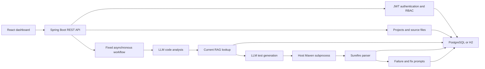

# TestPilot

TestPilot is a full-stack prototype for AI-assisted Java test generation and execution. The current application stores Java source files, runs a fixed multi-stage LLM workflow, retrieves testing guidance from a small in-database knowledge base, generates JUnit tests, executes Maven, parses Surefire reports, and presents the results in a React dashboard.

The long-term product is a repository-driven, agentic testing platform: a user supplies a GitHub repository, specialized LangGraph workflows plan unit, module, integration, and system tests, isolated workers run them against an immutable revision, and a measured RAG pipeline supplies project and framework context.

> [!WARNING]
> The current executor runs uploaded and generated Java code as a Maven subprocess on the application host. A timeout and per-run directory are not a security sandbox. Run only trusted code locally until the isolated-worker milestone is complete.

## Project status

| Capability | Current implementation | Target implementation |
|---|---|---|
| Repository input | Source files pasted through the API/UI | GitHub repository connector using immutable commit SHAs, with MCP support |
| Orchestration | Fixed Spring `@Async` sequence | Durable LangGraph workflows with checkpoints and human gates |
| Test types | One generated JUnit class | Unit, module, integration, and system-test specialists |
| Code analysis | LLM analysis of concatenated source text | Build-aware and Java symbol/AST analysis |
| Retrieval | In-memory cosine search over CSV vectors | Project-scoped hybrid retrieval with pgvector, lexical search, and citations |
| AI provider | Deterministic mock or basic OpenAI-compatible HTTP client | Versioned generation/embedding providers with traces and contract tests |
| Execution | Host Maven subprocess with a 60-second timeout | Non-root isolated workers with no network and resource limits |
| Evaluation | Application tests only | Retrieval, generation, coverage, mutation, latency, and cost benchmarks |

The detailed baseline assessment is in [PROJECT_DEEP_DIVE.md](PROJECT_DEEP_DIVE.md), and the approved implementation sequence is in [ROADMAP.md](ROADMAP.md).

## Current architecture



The classes named `*Agent` currently wrap task-specific prompt calls. They do not yet provide autonomous planning, tool selection, memory, reflection, or LangGraph execution.

## Technology

- Java 17 and Spring Boot 3.2.5
- Spring Security, JWT, JPA, PostgreSQL, and H2
- Maven 3.9.11 through Maven Wrapper
- React 18, React Router, Vite 7, and Tailwind CSS 3
- JUnit 5, Spring Security Test, MockMvc, and Surefire

## Prerequisites

- JDK 17
- Node.js 22 (the repository includes `.nvmrc`)
- npm 10 or newer
- PostgreSQL only when using the `dev` profile; H2 needs no external database

Maven does not need to be installed globally because the repository includes `mvnw` and `mvnw.cmd`.

## Run locally

### Backend with H2

```bash
./mvnw spring-boot:run -Dspring-boot.run.profiles=h2
```

The API starts at `http://localhost:8080`. The H2 console is intended only for this local profile.

### Frontend

```bash
cd frontend
nvm use
npm ci
npm run dev
```

The UI starts at `http://localhost:3000` and proxies `/api` requests to the backend.

### PostgreSQL development profile

Create a PostgreSQL database and supply configuration through the environment:

```bash
export SPRING_PROFILES_ACTIVE=dev
export DB_URL=jdbc:postgresql://localhost:5432/testpilot_db
export DB_USERNAME=testpilot
export DB_PASSWORD=testpilot
export JWT_SECRET=replace-with-a-long-random-secret
./mvnw spring-boot:run
```

The current `dev` profile uses Hibernate schema updates. Versioned database migrations are planned before deployment.

## Verify the project

Run the same quality gates used by CI:

```bash
./mvnw --batch-mode test
cd frontend
npm ci
npm run lint
npm run build
npm audit --audit-level=high
```

CI configuration lives in [.github/workflows/ci.yml](.github/workflows/ci.yml).

## Configuration

| Environment variable | Default | Purpose |
|---|---|---|
| `SPRING_PROFILES_ACTIVE` | `dev` | Selects PostgreSQL development or `h2` local profile |
| `PORT` | `8080` | Backend HTTP port |
| `DB_URL` | Local PostgreSQL URL | JDBC connection URL |
| `DB_USERNAME` | `testpilot` | Database username |
| `DB_PASSWORD` | `testpilot` | Database password |
| `JWT_SECRET` | Development fallback | JWT signing secret; must be replaced outside local development |
| `JWT_EXPIRATION_MS` | `86400000` | Token lifetime in milliseconds |
| `AI_PROVIDER` | `mock` | Use `mock` or `openai` |
| `AI_API_KEY` | Empty | Credential for the OpenAI-compatible provider |

The mock provider is deterministic and useful for offline workflow tests. Its embeddings are not semantic, and its generated test is intentionally trivial; it does not demonstrate real test-generation quality.

## API areas

| Area | Base route | Purpose |
|---|---|---|
| Authentication | `/api/auth` | Register and log in |
| Projects | `/api/projects` | Manage project metadata and pasted source files |
| AI analysis | `/api/projects/{id}/analyze` | Analyze stored source text |
| Test runs | `/api/projects/{id}/test-runs`, `/api/test-runs` | Generate, execute, and inspect runs |
| Failures | `/api/failures`, `/api/fix-suggestions` | Explain failures and review suggestions |
| Knowledge | `/api/knowledge` | Ingest and query the current retrieval scaffold |
| Health | `/api/health`, `/actuator/health` | Local health endpoints |

Public registration currently accepts a requested role. Do not expose the service publicly; forcing safe default roles and closing object-authorization gaps are Phase 2 work.

## Repository layout

```text
src/main/java/com/testpilot/
  ai/          LLM clients and task-specific prompt components
  auth/        users, JWT authentication, and authorization
  failure/     failure analysis and fix-review state
  project/     projects and source-file storage
  rag/         document chunking and in-memory vector search
  testing/     orchestration, Maven execution, and report parsing
frontend/      React dashboard
docs/          architecture decisions and threat model
```

## Development roadmap

Phase 1 establishes a reproducible and accurately documented baseline. Later phases secure the existing service, add repository ingestion, introduce LangGraph agents, isolate multi-level test execution, replace the RAG scaffold, add evaluations, and integrate reviewed results back into GitHub. See [ROADMAP.md](ROADMAP.md) for phase gates and deliverables.

## Contributing and security

Read [CONTRIBUTING.md](CONTRIBUTING.md) before opening a change. The current threat model and rules for handling untrusted repositories are documented in [docs/THREAT_MODEL.md](docs/THREAT_MODEL.md).

No open-source license has been selected yet. A license should be added only after repository ownership and the intended distribution terms are confirmed.
