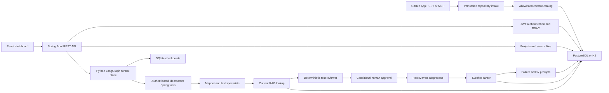

# TestPilot

TestPilot is a full-stack prototype for repository-driven, AI-assisted Java test generation and execution. The current application can connect an allowlisted GitHub repository through MCP or a least-privilege GitHub App, resolve an immutable commit, build a safe text catalog, run a checkpointed LangGraph workflow with specialized test agents and human approval, execute Maven with typed outcomes, parse Surefire reports, and present evidence in a React dashboard.

The long-term product is a repository-driven, agentic testing platform: a user supplies a GitHub repository, specialized LangGraph workflows plan unit, module/component, and integration tests, isolated workers run them against an immutable revision, and a measured RAG pipeline supplies project and framework context.

System and end-to-end testing are explicitly outside the project scope. TestPilot will stop at integration testing and will not provision or validate a complete deployed application environment.

> [!WARNING]
> The current executor runs uploaded and generated Java code as a Maven subprocess on the application host. A timeout and per-run directory are not a security sandbox. Run only trusted code locally until the isolated-worker milestone is complete.

## Project status

| Capability | Current implementation | Target implementation |
|---|---|---|
| Repository input | GitHub App REST and GitHub MCP connectors, immutable SHA ingestion, plus legacy pasted files | Installation UI polish and provider contract testing against a live GitHub sandbox |
| Orchestration | Separate Python LangGraph control plane, SQLite checkpoints, conditional routes, retry budgets, and human interrupt/resume | Shared production checkpointer and durable job dispatch |
| Test types | Conditional unit, module/component, and integration specialists plus deterministic review | Level-specific build templates, isolation policies, coverage, and mutation analysis |
| Code analysis | Deterministic repository metadata plus bounded LLM analysis | Build-aware and Java symbol/AST analysis |
| Retrieval | In-memory cosine search over CSV vectors | Project-scoped hybrid retrieval with pgvector, lexical search, and citations |
| AI provider | Deterministic mock or basic OpenAI-compatible HTTP client | Versioned generation/embedding providers with traces and contract tests |
| Execution | Host Maven subprocess with bounded logs, path defenses, timeout, and typed outcomes | Non-root isolated workers with no network and resource limits |
| Evaluation | Application tests only | Retrieval, generation, coverage, mutation, latency, and cost benchmarks |

The detailed baseline assessment is in [PROJECT_DEEP_DIVE.md](PROJECT_DEEP_DIVE.md), and the approved implementation sequence is in [ROADMAP.md](ROADMAP.md).

## Current architecture



LangGraph owns typed workflow state, conditional routing, retry policy, checkpoints, and human interrupts. Spring owns authentication, authorization, repository state, model calls, execution, and audit records. Agents cannot choose arbitrary tools or execute shell commands: every node maps to a compiled, authenticated Spring tool with an idempotency key and input hash.

## Technology

- Java 17 and Spring Boot 3.2.5
- Spring Security, JWT, JPA, PostgreSQL, and H2
- Maven 3.9.11 through Maven Wrapper
- React 18, React Router, Vite 7, and Tailwind CSS 3
- JUnit 5, Spring Security Test, MockMvc, and Surefire
- Python 3.12+, LangGraph 1.2, FastAPI, HTTPX, and a SQLite checkpointer

## Prerequisites

- JDK 17
- Node.js 22 (the repository includes `.nvmrc`)
- npm 10 or newer
- Python 3.12 or newer
- PostgreSQL only when using the `dev` profile; H2 needs no external database

Maven does not need to be installed globally because the repository includes `mvnw` and `mvnw.cmd`.

## Run locally

### Backend with H2

```bash
./mvnw spring-boot:run -Dspring-boot.run.profiles=h2
```

The API starts at `http://localhost:8080`. The H2 console is intended only for this local profile.

### LangGraph orchestrator

Run the Spring API first. In a second terminal, use the same internal token on both sides:

```bash
cd orchestrator
python3 -m venv .venv
.venv/bin/python -m pip install -r requirements.lock
export WORKFLOW_INTERNAL_TOKEN=test-only-workflow-token-at-least-32-bytes
export TESTPILOT_API_BASE=http://localhost:8080
export LANGGRAPH_CHECKPOINT_PATH=./data/checkpoints.sqlite3
.venv/bin/uvicorn app.main:app --host 127.0.0.1 --port 8090
```

For a non-H2 Spring profile, also export the same `WORKFLOW_INTERNAL_TOKEN` before starting Spring. The local checkpoint database is intentionally ignored by Git.

### Frontend

```bash
cd frontend
nvm use
npm ci
npm run dev
```

The UI starts at `http://localhost:3000` and proxies `/api` requests to the backend.

### PostgreSQL development profile

Create a PostgreSQL database and supply configuration through the environment:

```bash
export SPRING_PROFILES_ACTIVE=dev
export DB_URL=jdbc:postgresql://localhost:5432/testpilot_db
export DB_USERNAME=testpilot
export DB_PASSWORD=testpilot
export JWT_SECRET=replace-with-a-long-random-secret
./mvnw spring-boot:run
```

The current `dev` profile uses Hibernate schema updates. Versioned database migrations are planned before deployment.

## Verify the project

Run the same quality gates used by CI:

```bash
./mvnw --batch-mode test
cd orchestrator
python -m pip install -r requirements.lock
python -m compileall -q app tests
python -m pytest
cd frontend
npm ci
npm run lint
npm run build
npm audit --audit-level=high
```

CI configuration lives in [.github/workflows/ci.yml](.github/workflows/ci.yml).

## Configuration

| Environment variable | Default | Purpose |
|---|---|---|
| `SPRING_PROFILES_ACTIVE` | `dev` | Selects PostgreSQL development or `h2` local profile |
| `PORT` | `8080` | Backend HTTP port |
| `DB_URL` | Local PostgreSQL URL | JDBC connection URL |
| `DB_USERNAME` | `testpilot` | Database username |
| `DB_PASSWORD` | `testpilot` | Database password |
| `JWT_SECRET` | None outside H2 | JWT signing secret; at least 32 UTF-8 bytes |
| `JWT_EXPIRATION_MS` | `86400000` | Token lifetime in milliseconds |
| `BOOTSTRAP_ADMIN_ENABLED` | `false` | Explicitly enables one administrator bootstrap at startup |
| `BOOTSTRAP_ADMIN_NAME` | `TestPilot Administrator` | Bootstrap administrator display name |
| `BOOTSTRAP_ADMIN_EMAIL` | Empty | Bootstrap administrator email |
| `BOOTSTRAP_ADMIN_PASSWORD` | Empty | Bootstrap administrator password; at least 12 characters |
| `AI_PROVIDER` | `mock` | Use `mock` or `openai` |
| `AI_API_KEY` | Empty | Credential for the OpenAI-compatible provider |
| `LANGGRAPH_ORCHESTRATOR_URL` | `http://localhost:8090` | Internal LangGraph service URL used by Spring |
| `WORKFLOW_INTERNAL_TOKEN` | None outside H2 | Shared Spring/LangGraph credential; at least 32 UTF-8 bytes |
| `TESTPILOT_API_BASE` | `http://localhost:8080` | Spring workflow-tool base URL used by LangGraph |
| `LANGGRAPH_CHECKPOINT_PATH` | `orchestrator/data/checkpoints.sqlite3` | Local durable checkpoint database |

There is no production JWT fallback: `JWT_SECRET` must contain at least 32 UTF-8 bytes. The H2 profile supplies a test-only key.

### GitHub repository access

For the production path, register a GitHub App with read-only repository Contents permission and configure its setup callback and webhook URL. TestPilot exchanges the app JWT for short-lived installation tokens scoped to the selected repository.

| Environment variable | Purpose |
|---|---|
| `GITHUB_APP_ID` | GitHub App identifier |
| `GITHUB_APP_SLUG` | App slug used to start the installation flow |
| `GITHUB_APP_PRIVATE_KEY` | PKCS#8 PEM private key; escaped newlines are accepted |
| `GITHUB_WEBHOOK_SECRET` | HMAC secret for signed GitHub webhook deliveries |
| `GITHUB_API_BASE` | REST API base; defaults to `https://api.github.com` |
| `GITHUB_MCP_TOKEN` | Token for the configured GitHub MCP endpoint |
| `GITHUB_MCP_ENDPOINT` | Streamable HTTP MCP endpoint |
| `GITHUB_MCP_ALLOWED_REPOSITORIES` | Comma-separated `owner/repository` allowlist enforced before MCP calls |

The MCP adapter invokes only repository read tools. The GitHub App adapter is the preferred multi-user production boundary because installation grants are bound to a TestPilot user through a one-time installation state.

The mock provider is deterministic and useful for offline workflow tests. Its embeddings are not semantic, and its generated test is intentionally trivial; it does not demonstrate real test-generation quality.

## API areas

| Area | Base route | Purpose |
|---|---|---|
| Authentication | `/api/auth` | Register and log in |
| Managed users | `/api/admin/users` | Admin-only reviewer/admin account creation |
| Projects | `/api/projects` | Manage project metadata and pasted source files |
| GitHub installations | `/api/integrations/github/install` | Bind a GitHub App installation with one-time state |
| Repository intake | `/api/projects/{id}/repository`, `/api/repositories` | Connect, refresh, inspect, and disconnect immutable repository catalogs |
| GitHub webhooks | `/api/integrations/github/webhooks` | Verify and apply installation-scope events |
| AI analysis | `/api/projects/{id}/analyze` | Analyze stored source text |
| Test runs | `/api/projects/{id}/test-runs`, `/api/test-runs` | Generate, execute, and inspect runs |
| Workflow review | `/api/test-runs/{id}/workflow` | Inspect node traces and approve/reject paused integration plans |
| Failures | `/api/failures`, `/api/fix-suggestions` | Explain failures and review suggestions |
| Knowledge | `/api/knowledge` | Ingest and query the current retrieval scaffold |
| Health | `/api/health`, `/actuator/health` | Local health endpoints |

Public registration always creates a developer. Reviewer and admin roles can only be assigned through the protected managed-user flow or the explicitly enabled bootstrap administrator.

## Repository layout

```text
src/main/java/com/testpilot/
  ai/          LLM clients and task-specific prompt components
  auth/        users, JWT authentication, and authorization
  failure/     failure analysis and fix-review state
  project/     projects and source-file storage
  repository/  connector contract, GitHub transports, immutable catalogs, and installation/webhook scope
  rag/         document chunking and in-memory vector search
  testing/     orchestration, Maven execution, and report parsing
orchestrator/  Python LangGraph control plane, checkpoint runtime, and graph tests
frontend/      React dashboard
docs/          architecture decisions and threat model
```

## Development roadmap

Phases 1–4 establish the reproducible baseline, secure the service, add immutable GitHub ingestion, and introduce checkpointed LangGraph workflows. The next approval gate is Phase 5, which moves compilation and testing into isolated workers. See [ROADMAP.md](ROADMAP.md) for phase gates and deliverables.

## Contributing and security

Read [CONTRIBUTING.md](CONTRIBUTING.md) before opening a change. The current threat model and rules for handling untrusted repositories are documented in [docs/THREAT_MODEL.md](docs/THREAT_MODEL.md).

No open-source license has been selected yet. A license should be added only after repository ownership and the intended distribution terms are confirmed.
