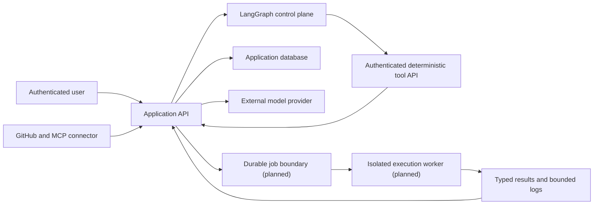

# TestPilot threat model

Status: updated through Phase 4. Security controls are incomplete; this document records the boundary rather than certifying the application for public use.

## Assets

- GitHub installation credentials and repository contents.
- User identities, JWT signing material, and authorization decisions.
- Source code, build files, generated tests, retrieved knowledge, prompts, and model responses.
- Worker capacity, execution logs, test results, failure reports, and review decisions.
- Application host, database, network, and future container runtime.

## Trust boundaries

All data crossing a boundary must be authenticated where applicable, authorized to a tenant/project, size limited, validated, and traceable.

## Untrusted inputs

- Repository names, branches, paths, file contents, symlinks, archives, and build descriptors.
- Java source, tests, dependencies, plugins, annotation processors, and scripts.
- Source comments, README text, issues, stack traces, knowledge documents, and retrieved chunks.
- LLM output, including file paths, commands, citations, test code, and structured fields.
- Surefire XML and subprocess stdout/stderr.
- LangGraph checkpoint state, resume decisions, node parameters, and tool responses.

Untrusted content is data, never instruction. A model response cannot authorize a repository write or directly select a host filesystem path or shell command.

## Current critical risks

| Risk | Current state | Required control |
|---|---|---|
| Host code execution | Maven executes uploaded/generated Java on the application host | Dedicated non-root worker with no network, hard resource limits, and no host mounts |
| Path traversal | Supplied file paths reach workspace resolution | Canonical relative-path allowlist, symlink rejection, and root containment check |
| Privilege escalation | Public registration accepts a requested role | Force the public default role and protect role administration |
| Object authorization | Some ID-based reads do not verify project access | Central authorization policy and cross-user endpoint tests |
| False success | Nonzero Maven outcomes can produce no reports and still complete | Capture bounded logs/exit code and model typed terminal outcomes |
| Secret exposure | Development JWT fallback and repository/model credentials | Secret manager/environment requirements, redaction, rotation, and fail-fast production config |
| Prompt injection | Repository and knowledge text is interpolated into prompts | Trust delimiters, deterministic tools, output schemas, scoped retrieval, and human write gates |
| Cross-project RAG leakage | Current chunks lack tenant/project scope | Authorization filters in the storage query plus negative tests |
| Denial of service | User code and LLM calls consume CPU, memory, time, and cost | Quotas, queue backpressure, resource limits, timeouts, cancellation, and budgets |

## GitHub and MCP rules

- Request read-only metadata/content permissions until the reviewed-delivery phase.
- Store installation identifiers, not long-lived personal access tokens.
- Resolve branch/tag input to a commit SHA before ingestion or execution.
- Re-authorize every repository operation against the installation scope.
- Exclude Git metadata, binaries, generated outputs, vendor directories, and suspected secrets from model and embedding calls.
- Treat MCP tool results as untrusted remote data and validate them through the same connector contract.
- Never expose a repository token, Docker socket, host home directory, or application environment to a test worker.

## LangGraph rules

- LangGraph controls ordering, conditional routing, retries, checkpoints, and human interrupts; it does not receive database or GitHub credentials.
- Graph nodes can call only the versioned Spring workflow-tool contract with a dedicated 32-byte-or-longer shared secret.
- Tool calls are bound to a registered TestRun, workflow thread, graph version, immutable revision, input hash, and idempotency key.
- A resumed checkpoint must replay completed tool output instead of repeating a completed side effect.
- Integration plans that identify databases, messaging, or HTTP dependencies pause before execution for a project-authorized human decision.
- Free-form model output cannot invoke a shell command or select a tool name; graph topology and tool names are code-defined.

## Execution-worker target

The worker must run as a non-root user with a read-only root filesystem, a fresh temporary workspace, dropped Linux capabilities, bounded PIDs/CPU/memory/file sizes/logs, a strict wall-clock timeout, and no network during compilation/test execution. Dependency resolution, when necessary, is a separate policy-controlled stage using an allowlisted cache.

## Abuse cases to test

- Absolute paths, `../`, encoded traversal, symlink escapes, case variants, and oversized file trees.
- Static initializers and tests that read files, access environment variables, call the network, spawn processes, fork recursively, allocate memory, fill disk, or loop forever.
- A developer requesting `ADMIN` and one user requesting another user's project/run/failure/chunk IDs.
- Repository instructions that ask the model to ignore policies, reveal secrets, or write to GitHub.
- Malformed/oversized Surefire XML, missing reports, compiler errors, dependency failures, and worker termination.
- Duplicate webhooks, repeated graph nodes, application restarts, lease expiry, and concurrent retries.

## Security release gate

The application must not be presented as safe for public, multi-tenant execution until Phase 2 authorization/path/result controls and Phase 5 isolated workers have passed their negative test suites.
