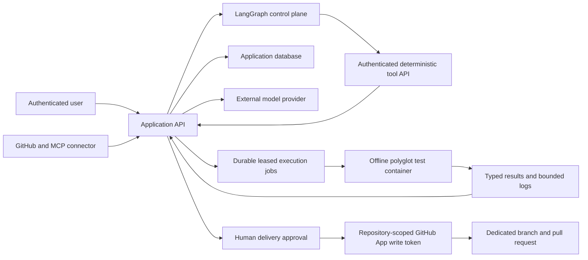

# TestPilot threat model

Status: updated for revised Phase 3; see [ADR 0008](adr/0008-offline-polyglot-execution.md). Security controls are implemented for the repository, workflow, retrieval, container-execution, evaluation, observability, and reviewed-delivery boundaries, but this document does not certify any particular deployment for public use.

## Assets

- GitHub installation credentials, repository contents, delivery branches, and pull requests.
- User identities, JWT signing material, and authorization decisions.
- Source code, build files, generated tests, retrieved knowledge, prompts, and model responses.
- Worker capacity, execution logs, test results, failure reports, and review decisions.
- Application host, database, network, and future container runtime.

## Trust boundaries

All data crossing a boundary must be authenticated where applicable, authorized to a tenant/project, size limited, validated, and traceable.

## Untrusted inputs

- Repository names, branches, paths, file contents, symlinks, archives, and build descriptors.
- Java source, tests, dependencies, plugins, annotation processors, and scripts.
- Source comments, README text, issues, stack traces, knowledge documents, and retrieved chunks.
- LLM output, including file paths, commands, citations, test code, and structured fields.
- Surefire XML and subprocess stdout/stderr.
- LangGraph checkpoint state, resume decisions, node parameters, and tool responses.

Untrusted content is data, never instruction. A model response cannot authorize a repository write or directly select a host filesystem path or shell command.

## Current critical risks

| Risk | Current state | Required control |
|---|---|---|
| Host code execution | Every profile uses the constrained non-root offline container | Continuously verify the worker policy; no application host fallback |
| Path traversal | Supplied file paths reach workspace resolution | Canonical relative-path allowlist, symlink rejection, and root containment check |
| Privilege escalation | Public registration is forced to developer; reviewer/admin creation is protected | Preserve role-administration tests and fail closed on unknown roles |
| Object authorization | Central project authorization and cross-user negative tests cover run, RAG, repository, observability, and delivery endpoints | Apply the same policy to every future ID-based endpoint |
| False success | Nonzero Maven outcomes can produce no reports and still complete | Capture bounded logs/exit code and model typed terminal outcomes |
| Secret exposure | Development JWT fallback and repository/model credentials | Secret manager/environment requirements, redaction, rotation, and fail-fast production config |
| Prompt injection | Repository and knowledge text is interpolated into prompts | Trust delimiters, deterministic tools, output schemas, scoped retrieval, and human write gates |
| Cross-project RAG leakage | Dense and lexical candidates require tenant/project/commit/model scope; global guides have an explicit zero scope | Preserve mandatory filters and cross-project negative tests for every storage adapter |
| Dependency supply chain | Reviewed tooling is installed at image-build time | Review and pin worker dependencies; runtime installation and network access are prohibited |
| Denial of service | User code and LLM calls consume CPU, memory, time, and cost | Current worker limits, timeouts, cancellation, retrieval budgets, plus deployment quotas and queue backpressure |

## GitHub, MCP, and delivery rules

- Use contents-read tokens for discovery and immutable ingestion. Do not reuse them for delivery.
- Request a repository-narrowed token with `contents:write` and `pull_requests:write` only after a persisted proposal receives a project-authorized human approval.
- Store installation identifiers, not long-lived personal access tokens.
- Resolve branch/tag input to a commit SHA before ingestion or execution.
- Re-authorize every repository operation against the installation scope.
- Freeze delivery files, patch SHA-256, evidence, limitations, and base commit before review; later source/model changes must require a new TestRun and proposal.
- Permit only dedicated `testpilot/...` branches whose commit parent is the analyzed SHA. Never update the default/protected branch ref.
- Reject delivery when execution did not succeed, tests failed, the target test path already exists, the repository connection changed, or transport is MCP.
- Persist reviewer identity/decision, validation time, delivery attempts, PR/head identity, failure details, audit events, and a close-PR/delete-branch rollback path.
- If PR creation fails after TestPilot creates its branch, attempt compensating deletion of only that dedicated branch; retain the failure and manual rollback instructions.
- Exclude Git metadata, binaries, generated outputs, vendor directories, and suspected secrets from model and embedding calls.
- Treat MCP tool results as untrusted remote data and validate them through the same connector contract.
- Never expose a repository token, Docker socket, host home directory, or application environment to a test worker.

## LangGraph rules

- LangGraph controls ordering, conditional routing, retries, checkpoints, and human interrupts; it does not receive database or GitHub credentials.
- Graph nodes can call only the versioned Spring workflow-tool contract with a dedicated 32-byte-or-longer shared secret.
- Tool calls are bound to a registered TestRun, workflow thread, graph version, immutable revision, input hash, and idempotency key.
- A resumed checkpoint must replay completed tool output instead of repeating a completed side effect.
- Integration plans that identify databases, messaging, or HTTP dependencies pause before execution for a project-authorized human decision.
- Free-form model output cannot invoke a shell command or select a tool name; graph topology and tool names are code-defined.

## Execution-worker rules

All application executions run in the polyglot image with UID/GID 10001, a
read-only root, dropped capabilities, no-new-privileges and no network. Only the
bounded snapshot JSON is mounted from the host, read-only; writable repository
storage is bounded tmpfs. Dependencies must already exist in the reviewed image.
There is no local profile exception or runtime networked dependency stage. See
[Phase 3](REVISED_PHASE_3.md) for fixed resource/time/output limits.

Legacy TestRun jobs retain leases, heartbeats, cancellation and retries. Draft
attempts instead use explicit synchronous execution, optimistic locking, one
latest-result record and stale-attempt cleanup. Both revalidate source input and
use the same container executor. Neither receives credentials, Docker socket or
host-home mounts. Cleanup is best effort if the Docker daemon is unavailable.

Reports are bounded untrusted evidence, not attestation. Repository code can
fabricate assertions/reports in its own container. Success requires consistent
exit/case evidence but cannot establish usefulness or prevent deliberate forgery.
Live container checks are required in CI. Local Phase 3 verification passed all
25 container cases and the real application executor/cancellation tests; see the
[verification summary](verification/phase3-summary.json).

## RAG rules

- Generation and embedding providers are separate; changing the embedding model creates a separate index identity.
- Every project candidate query includes tenant, project, immutable commit, and embedding-model filters before ranking.
- Global testing guidance is stored only in the explicit `tenant=0/project=0/commit=global` scope.
- Dense and lexical lists are fused and reranked only after storage-level scope filtering.
- Retrieved content remains untrusted prompt data and cannot select tools or authorize execution.
- Every generated test stores a trace ID whose record contains the exact packed context, ordered citations, query hash, retrieval configuration, and content hashes.

## Evaluation and observability rules

- The deterministic CI dataset is versioned and SHA-256 pinned; changing cases or relevance judgments requires an explicit configuration update and review.
- Regression thresholds fail closed. A result must not be improved by deleting difficult cases, weakening a seeded defect, or mixing fixture and live-provider experiments.
- Benchmark Java executes through temporary Maven workspaces and contains only repository-owned fixtures. It is not an authorization to execute arbitrary external repositories outside the revised Phase 3 worker boundary.
- The TestRun observability endpoint uses project read authorization. It exposes aggregate metadata and trace identifiers, not prompts, retrieved source bodies, model responses, credentials, or environment values.
- Token counts and prices are estimates unless provider-reported usage is explicitly stored; zero-cost mock runs must not be presented as production cost measurements.

## Abuse cases to test

- Absolute paths, `../`, encoded traversal, symlink escapes, case variants, and oversized file trees.
- Static initializers and tests that read files, access environment variables, call the network, spawn processes, fork recursively, allocate memory, fill disk, or loop forever.
- A developer requesting `ADMIN` and one user requesting another user's project/run/failure/chunk IDs.
- Repository instructions that ask the model to ignore policies, reveal secrets, or write to GitHub.
- Malformed/oversized Surefire XML, missing reports, compiler errors, dependency failures, and worker termination.
- Duplicate webhooks, repeated graph nodes, application restarts, lease expiry, and concurrent retries.
- Replayed delivery requests, approval bypasses, stale or changed repository connections, pre-existing test paths, unsafe refs, branch collisions, partial GitHub failures, and attempts to deliver through MCP or the default branch.

## Security release gate

The application must not be presented as safe for public, multi-tenant execution solely because the code contains these controls. A deployment must additionally prove its Docker/runtime policy, dependency-egress allowlist, database isolation/backups, secret handling, quotas, monitoring, and incident response. CI exercises the worker contract and project-scope negative tests.
